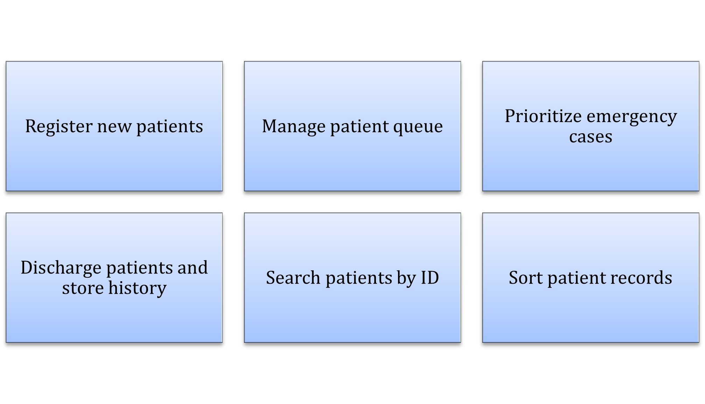
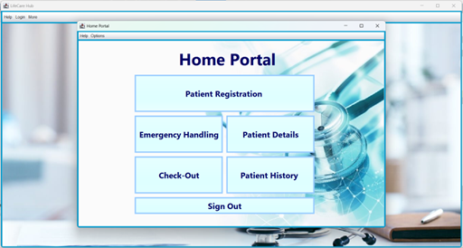
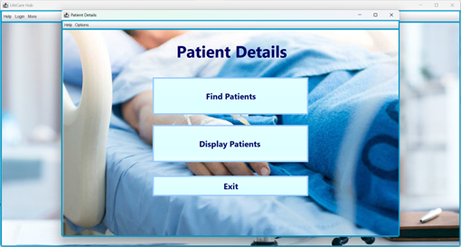
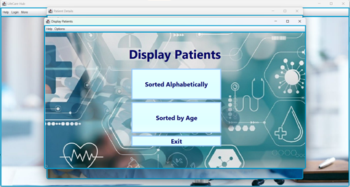

# LifeCare-Hub-Hospital-Management-system
The system must allow patients to be registered, prioritized based on severity, and searched quickly, while also maintaining a retrievable history.

  

---

## Introducation

Hospitals face challenges in managing patient registration, prioritization of treatment, and retrieval of medical records. This system is designed to implement a Hospital Patient Management System (HPMS) that applies data structures and algorithms to solve these programming problems efficiently.

  

---

## System Requirements

1. Patient Registration & Queueing

•	Used a linked list (or equivalent) to store the patient check-in queue.
•	Each patient record includes:
- Patient ID (unique)
- Name
- Age
- Illness/Reason for visit
- Severity level (Critical / Serious / Normal)
- Check-in timestamp

2. Emergency Handling
   
•	Implemented by using a priority queue (heap) for treatment order:
- Patients with higher severity are treated first.
- Patients with equal severity are treated in order of arrival.

3. Patient History Retrieval
- Used a hash table or binary search tree to store discharged patient records.
- Enabled quick lookup by Patient ID.

4. Searching & Sorting

•	Implemented:
- Searching algorithm (binary search) for finding patients by ID.
- Sorting algorithm (merge sort or quicksort) to display patients alphabetically or by age.

  
  
  

---

