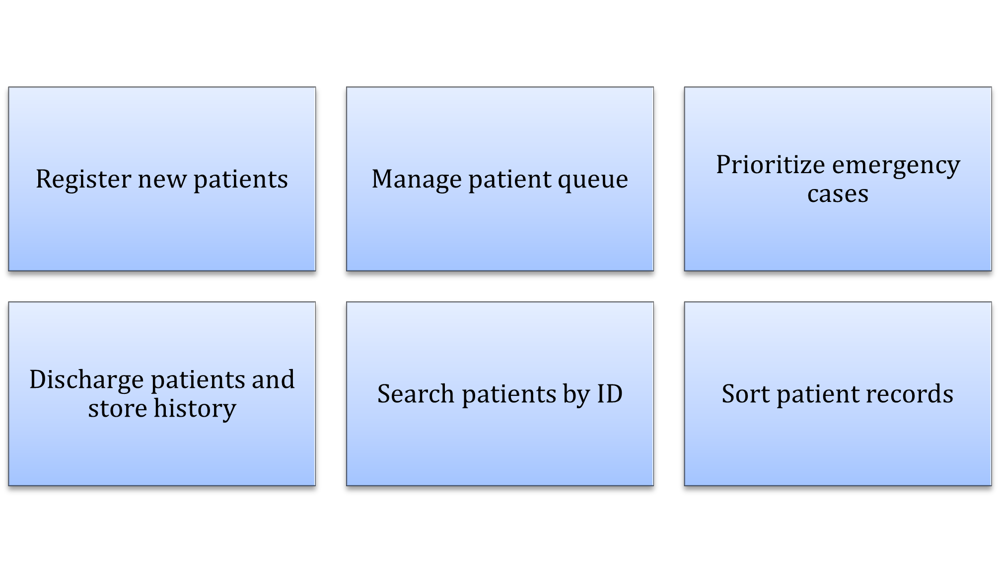
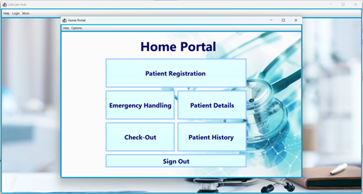
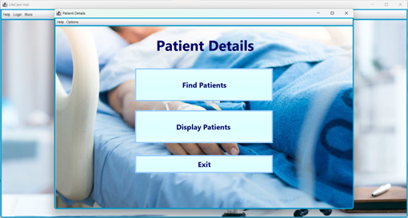
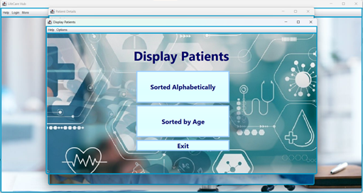

# 🏥 LifeCare Hub – Hospital Management System

A **Hospital Patient Management System (HPMS)** designed to efficiently manage patient registration, treatment prioritization, patient history, searching, and sorting using **Data Structures and Algorithms**.

## 📌 Introduction

Hospitals need efficient systems to manage patients, especially when dealing with emergency cases and large amounts of medical records.

**LifeCare Hub** is designed to solve these challenges by applying different data structures and algorithms for:

* Patient registration
* Patient check-in queue management
* Emergency prioritization
* Patient history management
* Fast patient searching
* Patient sorting

<p align="center">
  
</p>

---

## ✨ Key Features

* 👤 **Patient Registration**
* 📋 **Patient Check-in Queue**
* 🚨 **Emergency Priority Handling**
* 🗂️ **Patient History Management**
* 🔍 **Fast Patient Searching**
* 📊 **Patient Sorting**
* 🕒 **Check-in Timestamp Tracking**
* 🏥 **Discharged Patient Records**

---

## ⚙️ System Requirements

### 1. Patient Registration & Queueing

A **Linked List** is used to store patients in the check-in queue.

Each patient record contains:

* Patient ID – Unique identifier
* Name
* Age
* Illness / Reason for Visit
* Severity Level

  * 🔴 Critical
  * 🟠 Serious
  * 🟢 Normal
* Check-in Timestamp

<p align="center">
  
</p>

---

### 2. Emergency Handling

A **Priority Queue (Heap)** is used to determine the treatment order.

Patients are treated according to their severity:

**Critical → Serious → Normal**

If multiple patients have the same severity level, they are treated according to their **arrival order**.

This ensures that emergency patients receive priority while maintaining fairness between patients with the same severity.

---

### 3. Patient History Retrieval

A **Hash Table** is used to store discharged patient records.

The Patient ID is used as the key, allowing the system to quickly retrieve previous patient information.

Main operations include:

* Insert discharged patient
* Search patient history
* Display patient history

The average lookup complexity of a hash table is **O(1)**.

---

### 4. Searching & Sorting

#### 🔎 Binary Search

**Binary Search** is implemented to quickly find patients by Patient ID.

Binary Search requires the data to be sorted and has a time complexity of:

**O(log n)**

#### 🔤 Sorting

A sorting algorithm such as **Quick Sort** is used to display patients:

* Alphabetically by name
* By age
* By Patient ID

Sorting helps staff easily organize and view patient information.

---

## 🧠 Data Structures & Algorithms

| Requirement         | Data Structure / Algorithm |
| ------------------- | -------------------------- |
| Patient Queue       | Linked List                |
| Emergency Treatment | Priority Queue / Heap      |
| Patient History     | Hash Table                 |
| Patient Search      | Binary Search              |
| Patient Sorting     | Quick Sort / Merge Sort    |

---

## 🏗️ System Workflow

```text
              ┌─────────────────────┐
              │   Register Patient  │
              └──────────┬──────────┘
                         │
                         ▼
              ┌─────────────────────┐
              │  Check-in Queue     │
              │    Linked List      │
              └──────────┬──────────┘
                         │
                         ▼
              ┌─────────────────────┐
              │ Priority Queue      │
              │ Critical            │
              │ Serious             │
              │ Normal              │
              └──────────┬──────────┘
                         │
                         ▼
              ┌─────────────────────┐
              │     Treatment       │
              └──────────┬──────────┘
                         │
                         ▼
              ┌─────────────────────┐
              │      Discharge      │
              └──────────┬──────────┘
                         │
                         ▼
              ┌─────────────────────┐
              │     Hash Table      │
              │  Patient History    │
              └─────────────────────┘
```

---

## 📸 Screenshots

### Patient Registration

<p align="center">
  
</p>

### Patient Queue / Priority Handling

<p align="center">
  
</p>

### Patient History / Search

<p align="center">
  
</p>

---

## 📈 Algorithm Complexity

| Operation             | Data Structure    |         Complexity |
| --------------------- | ----------------- | -----------------: |
| Patient Insert        | Linked List       |               O(n) |
| Priority Queue Insert | Heap              |           O(log n) |
| Priority Queue Remove | Heap              |           O(log n) |
| Hash Table Search     | Hash Table        |       O(1) Average |
| Binary Search         | Sorted Array/List |           O(log n) |
| Quick Sort            | Array/List        | O(n log n) Average |

---

## 🎯 Project Objectives

The main objectives of LifeCare Hub are to:

* Apply data structures to a real-world hospital scenario.
* Improve patient treatment prioritization.
* Provide fast patient history retrieval.
* Implement efficient searching and sorting algorithms.
* Understand the practical applications of Data Structures and Algorithms.

---

## 🛠️ Technologies Used

* **Programming Language:** Java
* **GUI:** Java Swing
* **Data Structures:** Linked List, Priority Queue, Hash Table
* **Algorithms:** Binary Search, Quick Sort / Merge Sort
* **IDE:** NetBeans / IntelliJ IDEA / Eclipse

---

## 📂 Project Structure

```text
LifeCare-Hub-Hospital-Management-system/
│
├── Images/
│   ├── img1.png
│   ├── img2.png
│   ├── img3.png
│   ├── img4.png
│   └── img5.png
│
├── src/
│   ├── Patient/
│   ├── LinkedList/
│   ├── PriorityQueue/
│   ├── HashTable/
│   ├── Searching/
│   └── Sorting/
│
├── README.md
└── ...
```

---

## 🚀 Future Improvements

Possible future enhancements include:

* 🔐 User authentication and role-based access
* 💾 Database integration
* 👨‍⚕️ Doctor management
* 💊 Medicine and prescription management
* 📅 Appointment scheduling
* 📊 Hospital analytics dashboard
* 🧾 Digital medical reports
* ☁️ Cloud-based patient records

---

## 👩‍💻 Project Purpose

This project was developed as an academic project to demonstrate the practical application of **Data Structures and Algorithms** in a real-world **Hospital Patient Management System**.

---

## 📄 License

This project is intended for **educational and academic purposes**.
